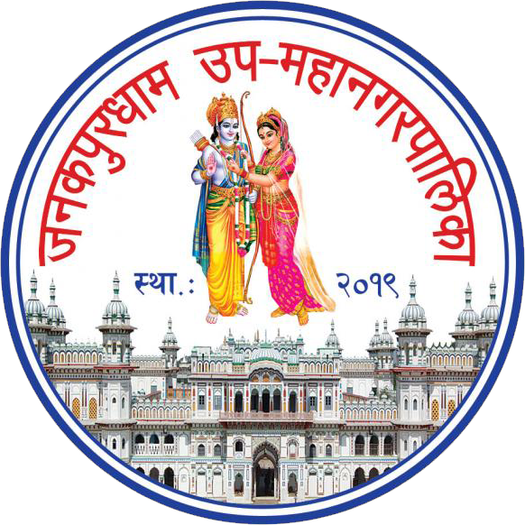

# eSifaris Project

A citizen recommendation and document management system for local government offices, built with PHP, HTML, CSS, and MySQL.

## Features

- Citizen registration and login
- Admin login and dashboard
- Application form for various certificates (birth, death, citizenship, marriage, poverty, etc.)
- File uploads for documents and citizenship images
- Admin dashboard with quick stats (total, pending, approved, rejected)
- Admin can view, approve, or reject applications
- Application status tracking
- Complaint submission
- Responsive and modern UI for both admin and citizen dashboards

## Setup Instructions

1. **Clone or copy the project files to your local server (e.g., XAMPP htdocs).**
2. **Create a MySQL database and import `backend/schema.sql` to set up tables.**
3. **Configure database connection in `backend/db.php`.**
4. **Run `backend/test.php` once to create an initial admin user.**
5. **Access the app via your browser:**
   - Citizen dashboard: `nagrikdashboard.php`
   - Admin dashboard: `admin-dashboard.php`

## Folder Structure

```
├── backend/
│   ├── admin_login.php
│   ├── applications.php
│   ├── applications_stats.php
│   ├── application_details.php
│   ├── db.php
│   ├── logout.php
│   ├── register.php
│   ├── schema.sql
│   ├── submit.php
│   ├── test.php
│   ├── update_application_status.php
├── admin-dashboard.php
├── admin-login.html
├── apply.html
├── citizen-login.html
├── nagrikdashboard.php
├── success.html
├── style.css
└── ...other HTML and asset files
```

## Usage

- Citizens can log in, apply for certificates, upload documents, and track status.
- Admins can log in, view all applications, approve/reject, and see dashboard stats.

## License

MIT
